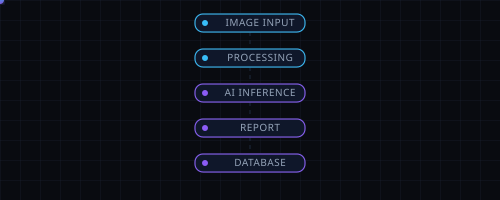

<div align="center">

```
BACKEND SYSTEMS · EVENT-DRIVEN · AI INTEGRATIONS
```

# I build systems that move, reason, and scale.

[Portfolio](https://atharva-warankar-portfolio.vercel.app) · [LinkedIn](https://linkedin.com/in/atharwaw01) · [Email](mailto:atharva.workx@gmail.com) · [GitHub](https://github.com/atharvaworkx)


</div>



---

## Selected systems

<table>
<tr>
<td width="55%" valign="top">

### Relay

**Agentic Integration Platform**

Event-driven platform connecting Salesforce with enterprise systems. An AI agent dynamically selects tools — customer lookup, order retrieval, case updates — based on workflow state.

`Python` `APIs` `PostgreSQL` `Redis` `AWS` `Docker`

`OAuth` · `RBAC` · `idempotency` · `circuit breaking` · `dead-letter handling`

</td>
<td width="45%" align="center">



</td>
</tr>
</table>

<table>
<tr>
<td width="45%" align="center">



</td>
<td width="55%" valign="top">

### NovaAI

**AI Diagnostic Integration Platform**

Multimodal inputs → async processing → AI inference → structured reports. Built around asynchronous workloads and event-driven pipelines.

`Django REST` `PostgreSQL` `Celery` `RabbitMQ` `Redis` `Docker`

</td>
</tr>
</table>

---

## At production scale

| | |
|---|---|
| **500+** concurrent sessions | **7,000+** items processed / day |
| **30%** shortlisting improvement | **25%** faster data retrieval |

---

## Experience

**Atomic Loops** · Backend Engineer Intern · 2025 — 2026
Distributed media pipelines, AI-driven data workflows, secure service integrations, event-driven processing.

**Sunsys Technologies** · Software Engineer Intern · 2025
Modular task systems, REST integrations, database workflows, performance optimization.

---

## Stack

`Python` `Django` `DRF` `PostgreSQL` `Redis` `RabbitMQ` `Celery` `Docker` `AWS` `React`

---

<div align="center">



</div>

---

## Let's build something useful.

If you're working on developer tools, AI infrastructure, backend platforms, or interesting product engineering — I'd be happy to collaborate.

[Email](mailto:atharva.workx@gmail.com) · [LinkedIn](https://linkedin.com/in/atharwaw01) · [Portfolio](https://atharva-warankar-portfolio.vercel.app) · [GitHub](https://github.com/atharvaworkx)

<br>

```
ATHARVA WARANKAR
Backend · Distributed Systems · AI
```


